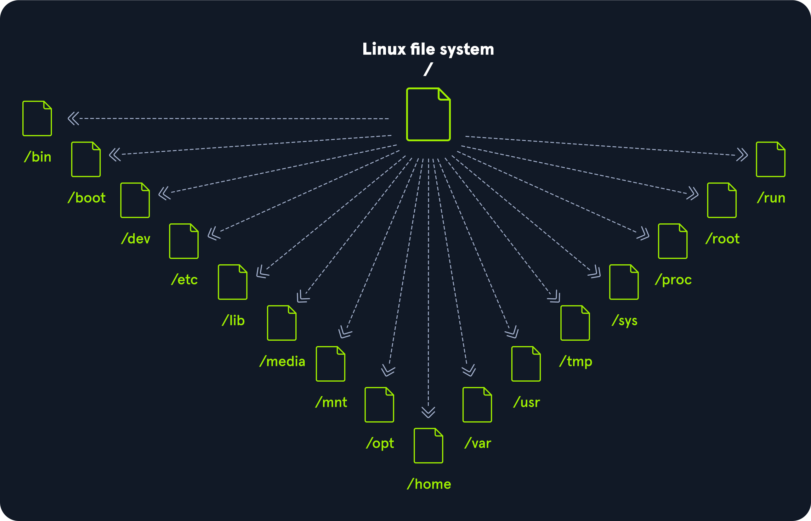

# Linux fundamentals
## Philosophy
Linux follows 5 core principles
| Principle          | Description        |
| :----------------- | :----------------- |
| Everyting is a file                                           |   All configuration files for the various services running on the Linux operating system are stored in one or more text files.   |
| Small, single-purpose programs                                |   Linux offers many different tools that we will work with, which can be combined to work together.   |
| Ability to chain programs together to perform complex tasks   |  The integration and combination of different tools enable us to carry out many large and complex tasks, such as processing or filtering specific data results.   |
| Avoid captive user interfaces                                 |  Linux is designed to work mainly with the shell (or terminal), which gives the user greater control over the operating system.   |
| Configuration data stored in a text file                      |  An example of such a file is the /etc/passwd file, which stores all users registered on the system.   |


## Components

| Component         | Description       |
| :---------------- | :---------------- |
| Bootloader        | A piece of code that runs to guide the booting process to start the operating system. Parrot Linux uses the GRUB Bootloader.|
| OS Kernel         | The kernel is the main component of an operating system. It manages the resources for system's I/O devices at the hardware level.|
| Daemons           | Background services are called "daemons" in Linux. Their purpose is to ensure that key functions such as scheduling, printing, and multimedia are working correctly. These small programs load after we booted or log into the computer.|
| OS Shell          | The operating system shell or the command language interpreter (also known as the command line) is the interface between the OS and the user. This interface allows the user to tell the OS what to do. The most commonly used shells are Bash, Tcsh/Csh, Ksh, Zsh, and Fish.|
| Graphics server   | This provides a graphical sub-system (server) called "X" or "X-server" that allows graphical programs to run locally or remotely on the X-windowing system.|
| Window Manager    | Also known as a graphical user interface (GUI). There are many options, including GNOME, KDE, MATE, Unity, and Cinnamon. A desktop environment usually has several applications, including file and web browsers. These allow the user to access and manage the essential and frequently accessed features and services of an operating system.|
| Utilities         | Applications or utilities are programs that perform particular functions for the user or another program.|

## Architecture
| Layer             | Description   |
| :---------------- | :------------ |
| Hardware          | Peripheral devices such as the system's RAM, hard drive, CPU, and others. |
| Kernel            | The core of the Linux operating system whose function is to virtualize and control common computer hardware resources like CPU, allocated memory, accessed data, and others. The kernel gives each process its own virtual resources and prevents/mitigates conflicts between different processes.                                                                            |
| Shell             | A command-line interface (CLI), also known as a shell that a user can enter commands into to execute the kernel's functions. |
| System Utility    | Makes available to the user all of the operating system's functionality. |

## File System Hierarchy
The Linux operating system is structured in a tree-like hierarchy and is documented in the [Filesystem Hierarchy ](https://www.pathname.com/fhs/) Standard (FHS). Linux is structured with the following standard top-level directories



| Path  | Description |
|-------|-------------|
| /     | The top-level directory is the root filesystem and contains all of the files required to boot the operating system before other filesystems are mounted, as well as the files required to boot the other filesystems. After boot, all of the other filesystems are mounted at standard mount points as subdirectories of the root. |
| /bin  | Contains essential command binaries. |
| /boot | Consists of the static bootloader, kernel executable, and files required to boot the Linux OS. |
| /dev  | Contains device files to facilitate access to every hardware device attached to the system. |
| /etc  | Local system configuration files. Configuration files for installed applications may be saved here as well. |
| /home | Each user on the system has a subdirectory here for storage. |
| /lib  | Shared library files that are required for system boot. |
| /media| External removable media devices such as USB drives are mounted here. |
| /mnt  | Temporary mount point for regular filesystems. |
| /opt  | Optional files such as third-party tools can be saved here. |
| /root | The home directory for the root user. |
| /sbin | This directory contains executables used for system administration (binary system files). |
| /tmp  | The operating system and many programs use this directory to store temporary files. This directory is generally cleared upon system boot and may be deleted at other times without any warning. |
| /usr  | Contains executables, libraries, man files, etc. |
| /var  | This directory contains variable data files such as log files, email in-boxes, web application related files, cron files, and more. |


## Linux Distributions
- [Ubuntu](https://ubuntu.com/)
- [Fedora](https://getfedora.org/)
- [CentOS](https://www.centos.org/)
- [Debian](https://www.debian.org/)
- [Red Hat Enterprise Linux](https://www.redhat.com/en/technologies/linux-platforms/enterprise-linux)

Some of the most popular Linux distributions for cyber security specialists (but not limited to)
||||
|:--|:--|:--|
|[ParrotOS](https://www.parrotsec.org/)|[Ubuntu](https://ubuntu.com/)|[Debian](https://www.debian.org/)|
|[Raspberry Pi OS](https://www.raspberrypi.com/software/)|[CentOS](https://www.centos.org/)|[BackBox](https://www.backbox.org/)|
|[BlackArch](https://www.blackarch.org/)|[Pentoo](https://www.pentoo.ch/)|[Kali Linux](https://kali.org/)|

## The Shell
### Definition
A Linux terminal, also called a shell or command line, provides a text-based input/output (I/O) interface between users and the kernel for a computer system.

### Existing shells
- Bash (Bourne-again SHELL)
- Tcsh/Csh
- Ksh
- Zsh
- Fish

### Prompt Description
The bash prompt is easy to understand and, by default, includes information such as the user, hostname, and current working directory. It is a string of characters displayed on the terminal screen that indicates that the system is ready for our input. It typically includes information such as the current user, the computer’s hostname, and the current working directory. The prompt is usually displayed on a new line, and the cursor is positioned after the prompt, ready for the user to start typing a command.

It can be customized to provide useful information to the user. The format can look something like this:
```
<username>@<hostname><current working directory>$
```

The home directory for a user is marked with a tilde <~> and is the default folder when we log in.

```
<username>@<hostname>[~]$
```

The dollar sign, in this case, stands for a user. As soon as we log in as root, the character changes to a hash <#> and looks like this:

```
root@htb[/htb]#
```

For example, when we upload and run a shell on the target system, we may not see the username, hostname, and current working directory. This may be due to the PS1 variable in the environment not being set correctly. In this case, we would see the following prompts:

**Unprivileged - User Shell Prompt**
```
$
```

**Privileged - Root Shell Prompt**
```
#
```

### System Information
List of necessary tools that will help us to get informations about the system, its processes, network configurations, users, directories, user settings, and the corresponding parameters.
|Command|Description|
|:--|:--|
|whoami|Display current username|
|id|Returns users identity|
|hostname|Sets or prints the current host system's name|
|uname|Prints basic information about the operating system name and system hardware|
|pwd|Returns current working directoty|
|ifconfig|Used to assign or to view an address to a network interface and/or configure network interface parameters|
|ip|Used to show or manipulate routing, network devices, interfaces and tunnels|
|netstat|Shows network status|
|ss|An utility to investigate sockets|
|ps|Shows process status|
|who|Displays who is logged in|
|env|Prints environnement or sets and executes command|
|lsblk|Lists block devices|
|lsusb|Lists USB devices|
|lsof|Lists opened files|
|lspci|List PCI devices|
